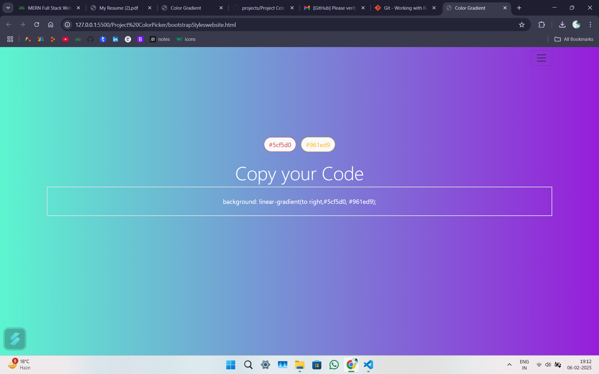
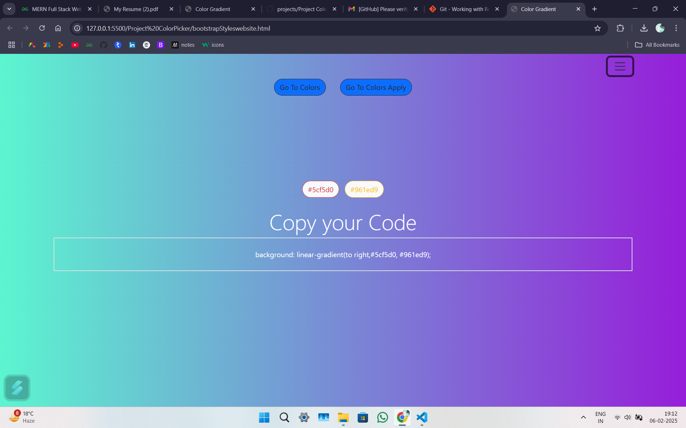
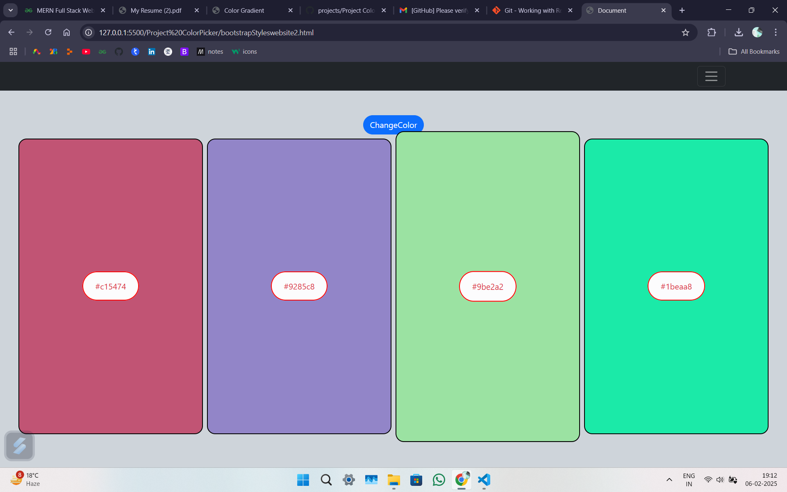
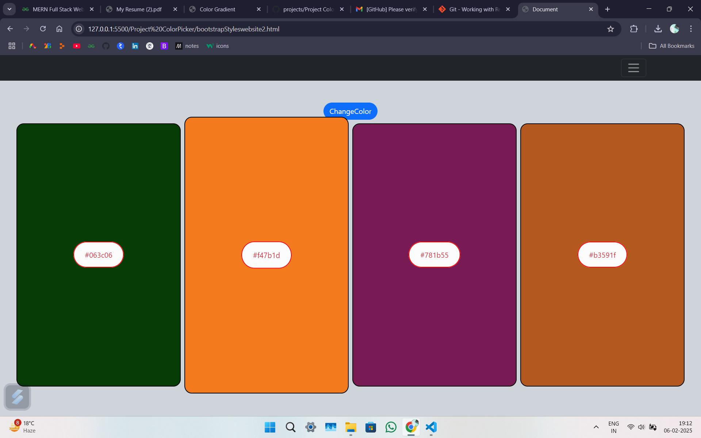
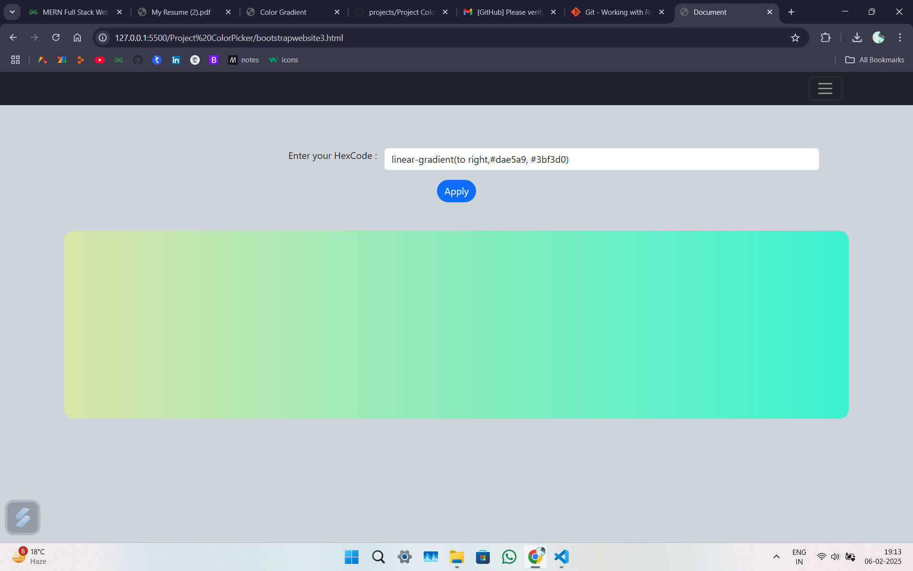
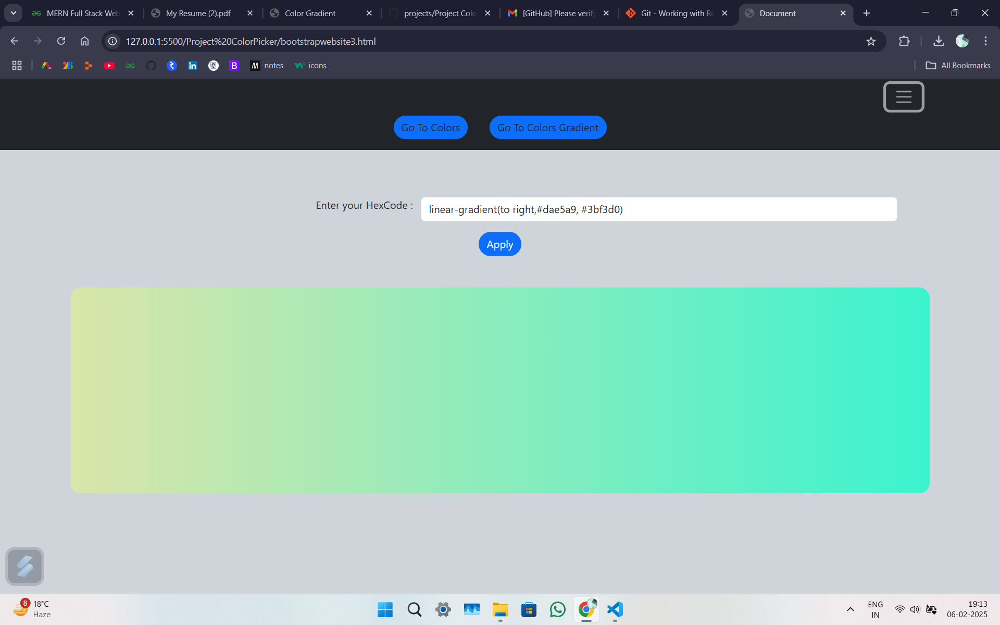
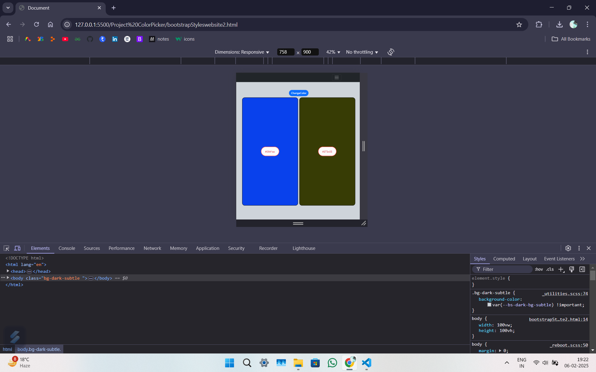

<head>
<link href="https://cdn.jsdelivr.net/npm/bootstrap@5.3.3/dist/css/bootstrap.min.css" rel="stylesheet"
        integrity="sha384-QWTKZyjpPEjISv5WaRU9OFeRpok6YctnYmDr5pNlyT2bRjXh0JMhjY6hW+ALEwIH" crossorigin="anonymous">
    
</head>
these are group of simple websites used for generating the color Hexcode these are written in bootstrap and are responsive in nature. you can click to copy color hexcode you like.
 
 
<a href="bootstrapStyleswebsite2.html"><button class="btn btn-outline-primary " id="newbtn">Go To Website </button> </a>
 
 

